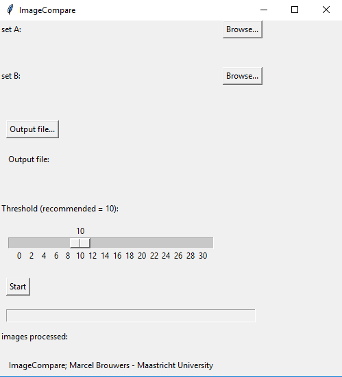

**ImageCompare**

The ImageCompare tool was created for the Maastricht University Library. The tool helps to find identical images in two sets of images. The matching of the images is done based on perceptive hashing using the imagehash library. The tool has a Tkinter gui for user friendliness. The tool can deal with jpeg, png and bmp files. The tool will also rotate the images 90, 180 and 270 degrees in order to also match files that might be saved in different orientations. 

**Using the application**

1.  Choose two folders with images you like to compare. (Set A and Set B)
2.  Choose where the output file (csv) will be generated
3.  Choose the Threshold, 10 is a good default value. 
4.  Start the program and drink coffee. 
5.  Check the results in the generated CSV file. Lower match scores represent better matches (a score of 0 is an exact match)

